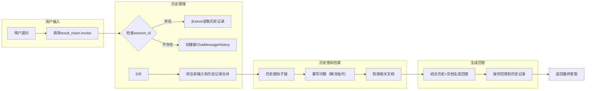

# 1、大体架构方案

| 类别         | 技术方案                 | 说明                                                         |
| ------------ | ------------------------ | ------------------------------------------------------------ |
| 基础模型     | DeepSeek-API             | 采用官方API进行模型调用，支持文本生成、意图识别、代码生成等场景 |
| 云平台       | 阿里云/腾讯云            | 选择容器服务+Serverless组合，按需弹性伸缩                    |
| 开发框架     | FastAPI + LangChain      | 快速构建Agent逻辑，支持工具调用链                            |
| 部署架构     | Kubernetes + Docker      | 容器化部署保障环境一致性                                     |
| 数据存储     | Redis + PostgreSQL + OSS | 分级存储：缓存/结构化数据/文件存储                           |
| 消息队列     | RocketMQ                 | 异步处理高并发请求                                           |
| 监控体系     | Prometheus + Grafana     | 实时监控API调用、资源使用情况（学习使用langsmith代替）语义   |
| 语义理解模型 | huggingface              | 使用中文 bge-large-zh-v1.5 模型                              |

```text
                          +-------------------+
                          | 客户端(Web/APP)   |
                          +-------------------+
                                   |
                                   ▼
                          +-------------------+
                          | API Gateway       |
                          | (身份验证/限流)    |
                          +-------------------+
                                   |
                          +--------+--------+
                          |                 |
                   +------v------+   +-----v-----+
                   | 同步请求处理 |   | 异步任务队列 |
                   | (FastAPI)   |   | (RocketMQ) |
                   +------+------+   +-----+-----+
                          |                 |
+----------------+        |                 |
| 第三方服务     <--------+                 |
| (支付/地图等)  |        |                 |
+----------------+        ▼                 ▼
                   +------+------+   +------+------+
                   | Agent核心   |   | 任务处理器  |
                   | (LangChain) +---> (Celery)    |
                   +------+------+   +------+------+
                          |                 |
                   +------v------+   +------v------+
                   | DeepSeek API|   | 数据库集群  |
                   | (模型服务)   |   | (PG+Redis)  |
                   +-------------+   +-------------+

```

# 2、常用基础包推荐

  | 包名           | 用途                           |
  | :------------- | :----------------------------- |
  | numpy          | 数值计算（多维数组、矩阵运算） |
  | pandas         | 数据清洗、分析（类似Excel）    |
  | requests       | 发送HTTP请求（访问API/网页）   |
  | matplotlib     | 数据可视化（绘制图表）         |
  | jupyter        | 交互式编程环境（代码+文档）    |
  | scikit-learn   | 机器学习算法库                 |
  | beautifulsoup4 | 网页解析（爬虫）               |
  | flask          | 轻量级Web框架                  |

# 3、python常用指令

```text
清空所有依赖，2个语句都执行：
pip freeze > requirements.txt
pip uninstall -r requirements.txt -y
```

# 4、langchain

## 4.1、langserver配置

这个操作流程存在混合使用pip和Poetry导致依赖管理混乱的问题，纠正后的全Poetry操作流程如下：

1. 安装全局工具（在任意目录执行）
```bash
# 安装 pipx（Python工具隔离管理）
python -m pip install --user pipx
python -m pipx ensurepath

# 通过 pipx 安装 poetry
pipx install poetry

pip install -U langchain-cli  #是 LangChain 的命令行工具
```

2. 创建项目（在项目目录外执行）
```bash
# 如果使用poetry new langserver新建项目，后边可能还需要执行第4步
langchain app new langserver
cd langserver

解决冲突的办法是去掉pyproject.toml中的pydantic = "<2"

# 初始化配置（根据需要调整pyproject.toml）
```

3. 统一用Poetry管理依赖（在项目目录执行）
```bash
# 安装核心依赖（替代原pip安装步骤）
poetry add "langserve[all]"   #超时问题可以单独安装某个依赖，eg: poetry add anyio
poetry add langchain-deepseek
poetry add langchain-community

# 可以继续添加其他依赖
poetry add langchain
```

4. 项目配置和代码修改
```bash
# 创建服务文件（手动创建app/server.py）
# 按原需求修改server.py内容
```

5. 运行服务（在项目目录执行）
```bash
# 在 poetry 虚拟环境中启动服务
poetry run langchain serve
```

## 4.2、其它配置

***poetry镜像配置及使用***

```markdown
# 镜像源配置，在pyproject.toml中添加:
[[tool.poetry.source]]
name = "tuna"
url = "https://pypi.tuna.tsinghua.edu.cn/simple"

# 镜像源使用：
poetry add numpy --source tuna
```

***监控配置***

```powershell
#配置LangSmith 监控开关，true开启，false关闭
SetX LANGCHAIN_TRACING_V2 "true"

#配置 LangSmith api key
SetX LANGCHAIN_API_KEY "your_api_key_here"  # 用户级变量

```

LangSmith官网:https://smith.langchain.com/ 

***搜索配置***

```powershell
#配置 taily api key
SetX TAVILY_API_KEY "..."
```

tavily官网:https://tavily.com/

# 5、embeddings-语义理解

将语义理解模型下载至本地（以bge-small-zh-v1.5为例）

```markdown
# 初始化 Git LFS 支持并配置 Git 仓库，使其能够处理大文件。
git lfs install
     
# 克隆bge-small-zh-v1.5模型到本地
git clone https://huggingface.co/BAAI/bge-small-zh-v1.5
```

python代码使用FlagEmbedding说明举例

```python
from FlagEmbedding import FlagModel

# 初始化FlagModel模型
# 参数说明：
# - model_path: 模型路径，指向预训练模型的存储位置
# - query_instruction_for_retrieval: 为检索任务添加的指令，用于生成查询的表示
# - use_fp16: 是否使用半精度浮点数（FP16）加速计算，可能会略微降低性能
model = FlagModel('D:/D/document/donotdelete/models/bge-small-zh/bge-small-zh-v1.5',
                  query_instruction_for_retrieval="为这个句子生成表示以用于检索相关文章：",
                  use_fp16=True)

# 定义两个句子列表，用于生成嵌入向量
sentences_1 = ["样例数据-1", "样例数据-2"]
sentences_2 = ["样例数据-3", "样例数据-4"]

# 使用模型对句子列表进行编码，生成对应的嵌入向量
embeddings_1 = model.encode(sentences_1)
embeddings_2 = model.encode(sentences_2)

# 计算两个嵌入向量集合的相似度矩阵
similarity = embeddings_1 @ embeddings_2.T
print(similarity)

print("\n===============================\n")

# 对于短查询到长文档（s2p）的检索任务，建议使用encode_queries()方法
# 该方法会自动为每个查询添加指令，适合处理短查询
# 而文档集合可以继续使用encode()或encode_corpus()方法，因为它们不需要额外指令
queries = ['query_1', 'query_2']
passages = ["样例文档-1", "样例文档-2"]

# 对查询和文档分别生成嵌入向量
q_embeddings = model.encode_queries(queries)
p_embeddings = model.encode(passages)

# 计算查询与文档之间的相似度得分矩阵
scores = q_embeddings @ p_embeddings.T
print(scores)

```

python代码使用sentence_transformers说明举例

```python
from sentence_transformers import SentenceTransformer

# 定义查询和文档集合
queries = ['query_1', 'query_2']  # 查询列表，每个元素为一个查询字符串
passages = ["样例文档-1", "样例文档-2"]  # 文档列表，每个元素为一个文档字符串
instruction = "为这个句子生成表示以用于检索相关文章："  # 指令字符串，用于增强查询的语义信息

# 加载本地预训练模型
model_path = "D:/D/document/donotdelete/models/bge-small-zh/bge-small-zh-v1.5"  
# 模型路径：指向本地存储的SentenceTransformer模型文件夹，需包含pytorch_model.bin等必要文件
model = SentenceTransformer(model_path)

# 对查询进行编码，生成查询嵌入向量
# 将指令与每个查询拼接后编码，并对嵌入向量进行归一化处理
q_embeddings = model.encode([instruction + q for q in queries], normalize_embeddings=True)

# 对文档集合进行编码，生成文档嵌入向量
# 对文档列表进行编码，并对嵌入向量进行归一化处理
p_embeddings = model.encode(passages, normalize_embeddings=True)

# 计算查询与文档之间的相似度分数
# 使用矩阵乘法计算查询嵌入与文档嵌入的余弦相似度
scores = q_embeddings @ p_embeddings.T

# 输出每个查询与文档的相似度分数
for query, score in zip(queries, scores):
    print(f"query: {query}")  # 打印当前查询
    for passage, score in zip(passages, score):
        # 打印每个文档及其与当前查询的相似度分数
        print(f"passage: {passage}, score: {score}")
```

python代码使用Langchain说明举例

```python
from langchain_huggingface import HuggingFaceEmbeddings

# 初始化 HuggingFaceBgeEmbeddings 模型的配置和实例化
# 参数说明：
# - model_name: 指定使用的预训练模型名称或路径，例如 "BAAI/bge-large-en-v1.5"。
# - model_kwargs: 模型加载时的额外参数，例如指定设备为 'cuda' 以使用 GPU 加速。
# - encode_kwargs: 编码时的额外参数，例如设置 'normalize_embeddings' 为 True 以计算余弦相似度。
# - query_instruction: 查询指令，用于生成句子表示以支持检索任务。
# 返回值：无（代码片段未包含返回值逻辑）

model_name = "D:/D/document/donotdelete/models/bge-small-zh/bge-small-zh-v1.5"  # 指定使用的预训练模型名称

# 配置模型加载参数，指定设备为 GPU（如果可用），则需修改为 'cuda'
model_kwargs = {'device': 'cpu'}

# 配置编码参数，设置 normalize_embeddings 为 True 以支持余弦相似度计算
encode_kwargs = {'normalize_embeddings': True}

# 实例化 HuggingFaceBgeEmbeddings 模型，传入模型名称、加载参数、编码参数和查询指令
model = HuggingFaceEmbeddings(
    model_name=model_name,
    model_kwargs=model_kwargs,
    encode_kwargs=encode_kwargs,
)

def generate_query_embedding(query: str):
    # 手动拼接查询指令
    full_query = f"为这个句子生成表示以用于检索相关文章：{query}"
    return model.embed_query(full_query)

# 示例调用
query = "这是一段测试文本"
embedding = generate_query_embedding(query)
print(embedding)

```

# 6、RAG+langchat



