# 1、大体架构方案

| 类别         | 技术方案             | 说明                                                         |
| ------------ | -------------------- | ------------------------------------------------------------ |
| 基础模型     | DeepSeek-API         | 采用官方API进行模型调用，支持文本生成、意图识别、代码生成等场景 |
| 云平台       | 阿里云/腾讯云        | 选择容器服务+Serverless组合，按需弹性伸缩                    |
| 开发框架     | FastAPI + LangChain  | 快速构建Agent逻辑，支持工具调用链                            |
| 部署架构     | Kubernetes + Docker  | 容器化部署保障环境一致性                                     |
| 数据存储     | Redis + mysql + OSS  | 分级存储：缓存/结构化数据/文件存储                           |
| 消息队列     | RocketMQ             | 异步处理高并发请求                                           |
| 监控体系     | Prometheus + Grafana | 实时监控API调用、资源使用情况（学习使用langsmith代替）语义   |
| 语义理解模型 | huggingface          | 使用中文 bge-large-zh-v1.5 模型                              |

```mermaid
graph TD
    A["客户端(Web/APP)"] --> B["API Gateway\n(身份验证/限流)"]
    B --> C["同步请求处理\n(FastAPI)"]
    B --> D["异步任务队列\n(RocketMQ)"]
    C --> E["第三方服务\n(支付/地图等)"]
    C --> F["Agent核心\n(LangChain)"]
    D --> G["任务处理器\n(Celery)"]
    F --> G
    G --> H["数据库集群\n(mysql+Redis)"]
    F --> I["DeepSeek API\n(模型服务)"]
    E -.-> C
```



# 2、常用基础包推荐

  | 包名           | 用途                           |
  | :------------- | :----------------------------- |
  | numpy          | 数值计算（多维数组、矩阵运算） |
  | pandas         | 数据清洗、分析（类似Excel）    |
  | requests       | 发送HTTP请求（访问API/网页）   |
  | matplotlib     | 数据可视化（绘制图表）         |
  | jupyter        | 交互式编程环境（代码+文档）    |
  | scikit-learn   | 机器学习算法库                 |
  | beautifulsoup4 | 网页解析（爬虫）               |
  | flask          | 轻量级Web框架                  |

# 3、python常用指令

```text
清空所有依赖，2个语句都执行：
pip freeze > requirements.txt
pip uninstall -r requirements.txt -y
```

# 4、langchain

## 4.1、langserve配置

这个操作流程存在混合使用pip和Poetry导致依赖管理混乱的问题，纠正后的全Poetry操作流程如下：

1. 安装全局工具（在任意目录执行）
```bash
# 安装 pipx（Python工具隔离管理）
python -m pip install --user pipx
python -m pipx ensurepath

# 通过 pipx 安装 poetry
pipx install poetry

pip install -U langchain-cli  #是 LangChain 的命令行工具
```

2. 创建项目（在项目目录外执行）
```bash
# 如果使用poetry new langchain新建项目，后边可能还需要执行第4步
langchain app new langchain
cd langchain

解决冲突的办法是去掉pyproject.toml中的pydantic = "<2"

# 初始化配置（根据需要调整pyproject.toml）
```

3. 统一用Poetry管理依赖（在项目目录执行）
```bash
# 安装核心依赖（替代原pip安装步骤）
poetry add "langserve[all]"   #超时问题可以单独安装某个依赖，eg: poetry add anyio
poetry add langchain-deepseek
poetry add langchain-community

# 可以继续添加其他依赖
poetry add langchain
```

4. 项目配置和代码修改
```bash
# 创建服务文件（手动创建app/server.py）
# 按原需求修改server.py内容
```

5. 运行服务（在项目目录执行）
```bash
# 在 poetry 虚拟环境中启动服务
poetry run langchain serve
```

## 4.2、其它配置

***poetry镜像配置及使用***

```markdown
# 镜像源配置，在pyproject.toml中添加:
[[tool.poetry.source]]
name = "tuna"
url = "https://pypi.tuna.tsinghua.edu.cn/simple"

# 镜像源使用：
poetry add numpy --source tuna
```

***监控配置***

```powershell
#配置LangSmith 监控开关，true开启，false关闭
SetX LANGCHAIN_TRACING_V2 "true"

#配置 LangSmith api key
SetX LANGCHAIN_API_KEY "your_api_key_here"  # 用户级变量

```

LangSmith官网:https://smith.langchain.com/ 

***搜索配置***

```powershell
#配置 taily api key
SetX TAVILY_API_KEY "..."
```

tavily官网:https://tavily.com/

# 5、embeddings-语义理解

将语义理解模型下载至本地（以bge-small-zh-v1.5为例）

```markdown
# 初始化 Git LFS 支持并配置 Git 仓库，使其能够处理大文件。
git lfs install
     
# 克隆bge-small-zh-v1.5模型到本地
git clone https://huggingface.co/BAAI/bge-small-zh-v1.5
```

python代码使用FlagEmbedding说明举例

```python
from FlagEmbedding import FlagModel

# 初始化FlagModel模型
# 参数说明：
# - model_path: 模型路径，指向预训练模型的存储位置
# - query_instruction_for_retrieval: 为检索任务添加的指令，用于生成查询的表示
# - use_fp16: 是否使用半精度浮点数（FP16）加速计算，可能会略微降低性能
model = FlagModel('D:/D/document/donotdelete/models/bge-small-zh/bge-small-zh-v1.5',
                  query_instruction_for_retrieval="为这个句子生成表示以用于检索相关文章：",
                  use_fp16=True)

# 定义两个句子列表，用于生成嵌入向量
sentences_1 = ["样例数据-1", "样例数据-2"]
sentences_2 = ["样例数据-3", "样例数据-4"]

# 使用模型对句子列表进行编码，生成对应的嵌入向量
embeddings_1 = model.encode(sentences_1)
embeddings_2 = model.encode(sentences_2)

# 计算两个嵌入向量集合的相似度矩阵
similarity = embeddings_1 @ embeddings_2.T
print(similarity)

print("\n===============================\n")

# 对于短查询到长文档（s2p）的检索任务，建议使用encode_queries()方法
# 该方法会自动为每个查询添加指令，适合处理短查询
# 而文档集合可以继续使用encode()或encode_corpus()方法，因为它们不需要额外指令
queries = ['query_1', 'query_2']
passages = ["样例文档-1", "样例文档-2"]

# 对查询和文档分别生成嵌入向量
q_embeddings = model.encode_queries(queries)
p_embeddings = model.encode(passages)

# 计算查询与文档之间的相似度得分矩阵
scores = q_embeddings @ p_embeddings.T
print(scores)

```

python代码使用sentence_transformers说明举例

```python
from sentence_transformers import SentenceTransformer

# 定义查询和文档集合
queries = ['query_1', 'query_2']  # 查询列表，每个元素为一个查询字符串
passages = ["样例文档-1", "样例文档-2"]  # 文档列表，每个元素为一个文档字符串
instruction = "为这个句子生成表示以用于检索相关文章："  # 指令字符串，用于增强查询的语义信息

# 加载本地预训练模型
model_path = "D:/D/document/donotdelete/models/bge-small-zh/bge-small-zh-v1.5"  
# 模型路径：指向本地存储的SentenceTransformer模型文件夹，需包含pytorch_model.bin等必要文件
model = SentenceTransformer(model_path)

# 对查询进行编码，生成查询嵌入向量
# 将指令与每个查询拼接后编码，并对嵌入向量进行归一化处理
q_embeddings = model.encode([instruction + q for q in queries], normalize_embeddings=True)

# 对文档集合进行编码，生成文档嵌入向量
# 对文档列表进行编码，并对嵌入向量进行归一化处理
p_embeddings = model.encode(passages, normalize_embeddings=True)

# 计算查询与文档之间的相似度分数
# 使用矩阵乘法计算查询嵌入与文档嵌入的余弦相似度
scores = q_embeddings @ p_embeddings.T

# 输出每个查询与文档的相似度分数
for query, score in zip(queries, scores):
    print(f"query: {query}")  # 打印当前查询
    for passage, score in zip(passages, score):
        # 打印每个文档及其与当前查询的相似度分数
        print(f"passage: {passage}, score: {score}")
```

python代码使用Langchain说明举例

```python
from langchain_huggingface import HuggingFaceEmbeddings

# 初始化 HuggingFaceBgeEmbeddings 模型的配置和实例化
# 参数说明：
# - model_name: 指定使用的预训练模型名称或路径，例如 "BAAI/bge-large-en-v1.5"。
# - model_kwargs: 模型加载时的额外参数，例如指定设备为 'cuda' 以使用 GPU 加速。
# - encode_kwargs: 编码时的额外参数，例如设置 'normalize_embeddings' 为 True 以计算余弦相似度。
# - query_instruction: 查询指令，用于生成句子表示以支持检索任务。
# 返回值：无（代码片段未包含返回值逻辑）

model_name = "D:/D/document/donotdelete/models/bge-small-zh/bge-small-zh-v1.5"  # 指定使用的预训练模型名称

# 配置模型加载参数，指定设备为 GPU（如果可用），则需修改为 'cuda'
model_kwargs = {'device': 'cpu'}

# 配置编码参数，设置 normalize_embeddings 为 True 以支持余弦相似度计算
encode_kwargs = {'normalize_embeddings': True}

# 实例化 HuggingFaceBgeEmbeddings 模型，传入模型名称、加载参数、编码参数和查询指令
model = HuggingFaceEmbeddings(
    model_name=model_name,
    model_kwargs=model_kwargs,
    encode_kwargs=encode_kwargs,
)

def generate_query_embedding(query: str):
    # 手动拼接查询指令
    full_query = f"为这个句子生成表示以用于检索相关文章：{query}"
    return model.embed_query(full_query)

# 示例调用
query = "这是一段测试文本"
embedding = generate_query_embedding(query)
print(embedding)

```

# 6、RAG（检索增强生成）+langchat

## RAG完整流程：

```markdown
用户输入 → retrieval_chain.invoke() → 合并历史(create_history_aware_retrieve) → create_history_aware_retrieve重写后的问题作用于检索器（不做用于文档处理链） → 检索文档(retriever) → 将检索结果发送给create_stuff_documents_chai →  create_stuff_documents_chai根据原始问题和检索结果、历史聊天记录生成最终回答 → 更新历史聊天记录。

# 流程步骤（注释或文档中）
1. 📥 用户输入 
   - 输入: {"input": "问题", "chat_history": [...]}
   - 操作: 触发 retrieval_chain.invoke()

2. 🔄 合并历史 (create_history_aware_retriever)
   - 输入: 原始问题 + 历史对话
   - 操作: 重写问题 → "优化后的问题"
   - 输出: {"optimized_query": "优化后的问题"}

3. 🔍 检索文档 (retriever)
   - 输入: 优化后的问题
   - 操作: 从数据库/向量库检索
   - 输出: [Document1, Document2...]

4. 🛠️ 生成回答 (create_stuff_documents_chain)
   - 输入: 用户的原始问题 + 检索到的文档 + 历史聊天记录
   - 操作: 模型生成回答
   - 输出: {"answer": "最终回答"}

5. 📝 更新历史
   - 输入: 原始问题 + 最终回答
   - 操作: 追加到 chat_history
   - 输出: 更新后的 {"chat_history": [...]}

```

在LangChain框架中，create_stuff_documents_chain、create_history_aware_retriever和create_retrieval_chain是构建检索增强生成（RAG）流程的核心组件。它们各自承担不同的角色，协作实现结合历史上下文的高效文档检索与回答生成。以下是它们的作用和区别：

## create_stuff_documents_chain‌

**作用‌：**
创建一个‌文档处理链‌，负责将检索到的文档内容整合后输入语言模型（LLM），生成最终回答。其核心是“Stuffing”方法，即直接将所有相关文档内容拼接为单个上下文，与用户问题一起传给模型。这种方式简单高效，但需注意模型输入长度限制。

**适用场景‌：**
当文档数量较少或内容较短时，直接将全部内容塞入上下文，确保模型获取完整信息。

**示例代码逻辑‌：**

```python
#  输入：用户问题 + 检索到的文档列表 → 输出：模型生成的回答
chain = create_stuff_documents_chain(llm, prompt)
```

## create_history_aware_retriever‌

**作用‌：**
创建一个‌历史感知的检索器‌，在检索文档时考虑对话历史，优化当前查询。例如，用户后续问题可能依赖之前的对话上下文，该组件会动态调整查询语句以提高检索相关性。

**技术细节‌：**

结合历史信息重新生成或优化查询（如通过LLM重写问题）。
使用优化后的查询从向量库等数据源检索文档。

**示例代码逻辑‌：**

```python
#  输入：用户当前问题 + 对话历史 → 输出：优化查询后的相关文档
retriever = create_history_aware_retriever(llm, base_retriever, prompt)
```

## create_retrieval_chain‌

**作用‌：**
将‌历史感知检索器‌和‌文档处理链‌整合为端到端的流程，形成完整的RAG链。用户输入依次经过检索和生成两阶段，自动处理历史上下文、检索文档及生成回答。

**协作流程‌：**

检索阶段‌：利用create_history_aware_retriever生成的检索器，结合历史优化查询，获取相关文档。
生成阶段‌：通过create_stuff_documents_chain生成的链，将文档和问题输入LLM生成回答。

**示例代码逻辑‌：**

```python
#  输入：用户当前问题 + 对话历史 → 输出：最终回答（自动处理检索和生成）
retrieval_chain = create_retrieval_chain(retriever, document_chain)
```


